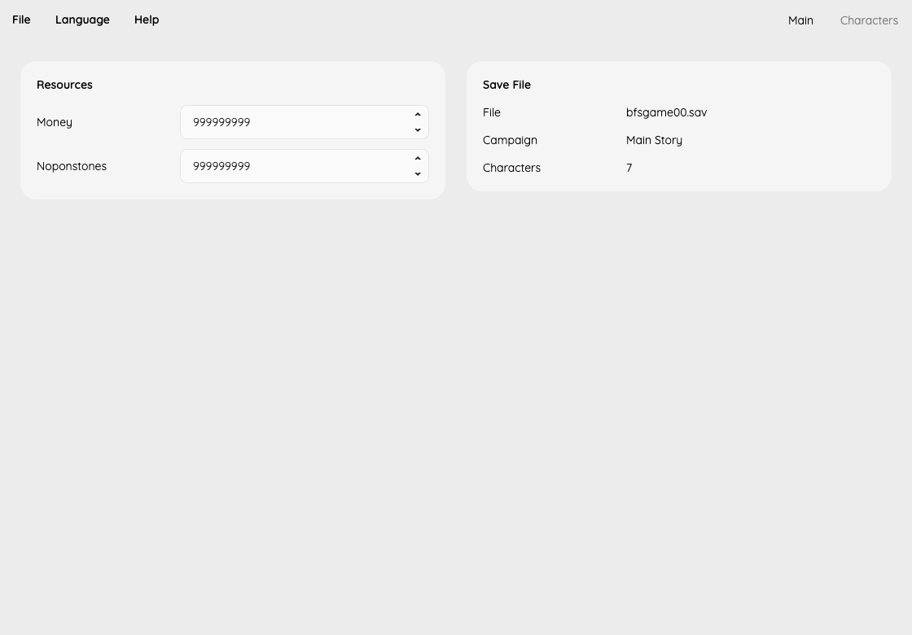

# XBDE Save Editor

Edit Xenoblade Chronicles: Definitive Edition saves, including Future Connected.



## Features

- **Save files:** Open compatible `bfsgame*.sav` and `bfsmeria*.sav` game saves, inspect the saved party and create byte-identical copies. System saves and thumbnails are not editable.
- **Main:** Edit money and Noponstones. Save and Save As are available in the File menu; unrecognized layouts are rejected and unknown bytes remain untouched.
- **Characters:** Search joined characters, select a level and edit linked EXP, AP, main-story Affinity Coins and Expert Mode reserve EXP. Maximize AP for one character or everyone already joined, or fill a character's reserve EXP. The highest attained level is available for inspection. Character names switch with the interface language. Future Connected does not expose Affinity Coin editing.
- **Arts:** In Characters → Arts, inspect learned and missing arts, select a level or maximize one art or all learned arts for the current character. Limits account for the campaign, Master books and Monado story permissions; fixed Talent Arts remain read-only. Melia's discharge levels stay linked to their summon arts. The same operations are available in the CLI.
- **CLI:** Inspect saves as JSON, copy them or edit resources without changing unknown data.

English is the default language. The interface also supports Simplified Chinese,
Traditional Chinese, Japanese, Korean, German, French, Spanish and Italian.
Help → About shows the version and repository link.
Art names currently use the verified English catalog; other game-language names
are not yet available.

## Get started

With the .NET 10 SDK installed:

```sh
dotnet run --project gui/XbdeEditor.Gui.csproj -c Release
dotnet run --project cli/Cli.csproj -- inspect /path/to/bfsgame00.sav
dotnet run --project cli/Cli.csproj -- copy /path/to/bfsgame00.sav /path/to/copy.sav
```

Resource inputs currently validate unsigned 32-bit storage bounds, not an
independently verified in-game currency cap. Existing high amounts are preserved
on opening; they are not silently normalized.
AP edits are restricted to 0–99,999,999, Affinity Coins to 0–999, and Expert Mode
reserve EXP to 0–199,999,998. Existing higher amounts are preserved unless edited.
Level editing respects each character's campaign-specific minimum and the level
99 cap. Changing level resets current EXP; entered EXP advances through the
game's level costs. Apply Changes commits the linked fields, and File → Save
writes the save. Direct level edits leave reserve EXP untouched. Changing reserve
EXP alone does not immediately change level; spend it in-game in Expert Mode.
Campaign identification currently uses joined characters. When only characters
shared by both campaigns are present, the campaign is shown as unconfirmed and
Affinity Coin editing is unavailable.

See the [CLI reference](CLI.md) and [development plan](docs/roadmap.md).

## Development

```sh
dotnet build XbdeEditor.slnx -c Release
dotnet run --project test/Core.Test.csproj -c Release --no-build
dotnet run --project test/Gui.Smoke.csproj -c Release --no-build
python3 tools/test_cli.py --cli cli/bin/Release/net10.0/XbdeEditor.Cli.dll
```

Releases use `python3 tools/release.py`. The script tests the current branch,
creates the version commit and pushes its tag. GitHub Actions packages the
desktop app and CLI with a shared runtime and generates release notes.
There is no published release yet.

## Credits

- [damysteryman/XCDESave](https://gitlab.com/damysteryman/XCDESave): documented save-format fields used as references. This project implements its parser independently and does not include the upstream library.
- [Xenoblade DE data tables](https://xenoblade.github.io/xb1de/bdat/index.html): game-data references.

## License

[MIT](./LICENSE) License © [jinghaihan](https://github.com/jinghaihan)
