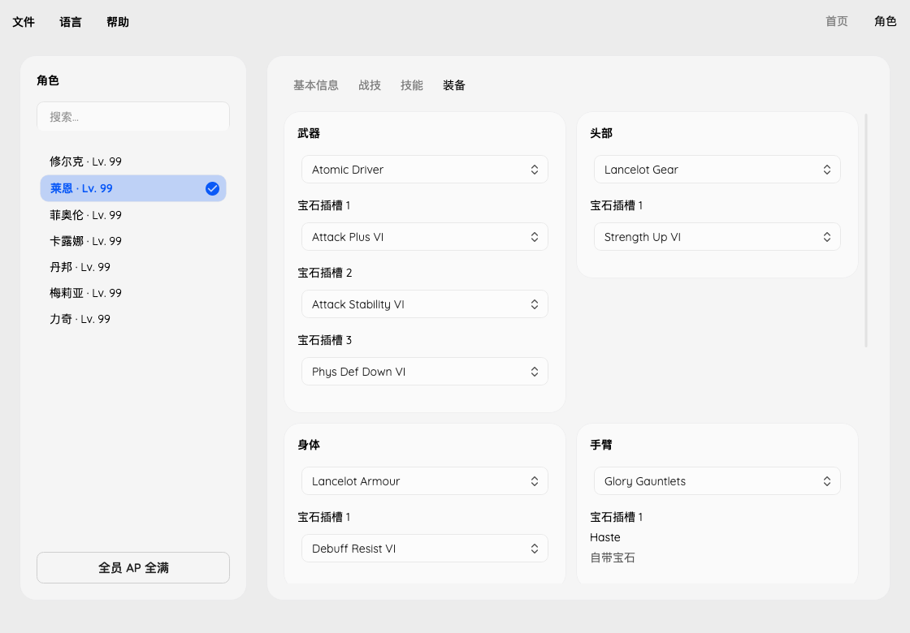

# Equipment validation

Characters → Equipment shows one weapon and five armor pieces in a shared
scroll area. Equipment names and gem names currently use English game catalogs;
interface labels support all nine languages.

## Inventory references

Character equipment fields contain a zero-based inventory index plus an item
type, not a global item ID. A referenced record must exist, match its stored
index and type, and contain exactly one item. Each bank contains 500 records
of `0x30` bytes:

| Slot | Character field | Inventory start | Type |
| --- | --- | --- | --- |
| Weapon | `+0x28` | `0x3B10` | 2 |
| Head | `+0x14` | `0x98D0` | 4 |
| Torso | `+0x18` | `0xF690` | 5 |
| Arms | `+0x1C` | `0x15450` | 6 |
| Legs | `+0x20` | `0x1B210` | 7 |
| Feet | `+0x24` | `0x20FD0` | 8 |

Character records begin at `0x152368`, with stride `0x138`. Appearance fields
are not edited. Unrecognized references remain visible for inspection rather
than being silently replaced.

## Gem fitting

The gem inventory begins at `0x2C380`, with 500 records of `0x2C` bytes.
Normal gems must have matching index/type, quantity one, rank I–VI, one known
effect and a clear cylinder flag. Socket fitting never rewrites gem records.
Effect names come from `BTL_skilllist`; selectors show decoded strength and
activation chance. Separate [gem editing](gems.md) is available in Items.

Equipment stores its socket count at `+0x15`. Normal references occupy four
bytes at `+0x18`, `+0x20` and `+0x28`; the adjacent four-byte fields hold fixed
gem references. A normal reference uses type 3. Index zero is valid; an empty
normal reference is the entire four-byte value zero. Fixed gems are read-only.

Only declared sockets up to three may be edited. All six equipment banks are
checked for occupied normal gem references, including unequipped items. A gem
cannot be fitted twice. Shared or unrecognized equipment references, incompatible
weapon/armor effects and unconfirmed campaigns reject edits. Setters validate the complete request before
changing bytes. Selecting a gem applies it to the in-memory document; File →
Save or Save As writes the file.

## Weapon and armor selection

Selectors list owned, structurally valid items for that slot and character.
Items already referenced by another joined character are excluded, even if that
character's reference has an invalid type. Shared current references cannot be
switched. The inventory record's armor class must match the extracted table.
Only duplicate names include an inventory index to distinguish individual items.

Main-story medium and heavy armor require a learned equipment skill or an
existing link to a learned skill in the correct donor row. Medium skills are
1, 26, 51, 76 and 101; heavy skills are 31, 98, 115 and 141. Hidden branches must
already be unlocked. Link entries are inspected, not added or rewritten.
The eight donor rows contain five one-byte skill IDs each at character `+0xC4`.
Mechon Fiora is restricted to her weapon/armor definitions. Human Fiora is not
offered heavy armor. Future Connected does not use passive skill trees and
allows normal armor classes for characters supported by the equipment table.

Flag-zero ordinary weapons and Mechon Fiora's flag-three weapons are selectable.
Other flagged weapons are conservatively excluded from switching,
including a currently equipped story-flagged Monado. Their existing gems can
still be edited. Unknown campaigns, malformed items and absent characters reject
switches rather than constructing a replacement. Appearance is not changed.

Selecting an item changes only the four-byte character equipment reference.
The new item's fixed/normal gems, damage values and other inventory bytes are
preserved. The old item and its gems remain in inventory. File → Save persists
the edit; no equipment is created, deleted or moved between inventory records.

## Evidence and limits

Field layouts were checked against the documented
[XCDESave format](https://github.com/hanyu1774/XCDE-Save-File-Editor/blob/master/XCDESave/PartyMember.cs)
and local main-story/Future Connected saves. Names were independently collected
from the game-data [item](https://xenoblade.github.io/xb1de/bdat/bdat_common/ITM_itemlist.html)
and [skill](https://xenoblade.github.io/xb1de/bdat/bdat_common/BTL_skilllist.html) tables.
No upstream parser code is included.

Eligibility metadata comes from the extracted
[weapon](https://xenoblade.github.io/xb1de/bdat/bdat_common/ITM_wpnlist.html) and
[armor](https://xenoblade.github.io/xb1de/bdat/bdat_common/ITM_equiplist.html)
tables, mapped through global item references rather than table row numbers.
Equipment slots use the item table's type: Mechon Fiora's armor `parts` values
do not follow the normal head/torso/arms/legs/feet convention.
The 1,572 mapped definitions are reproducible with
`uv run --with beautifulsoup4 python tools/fetch_equipment_rules.py` (JSON output).
Armor skills were checked against `BTL_PSVskill` and the passive skill catalog.
In the supplied executable (build ID `7E1DF8E08D60544BBDCA1E333C153C97`),
the armor initializer at `0xBDAC0` stores table `arm_type` at inventory `+0x14`
and `jwl_slot` at `+0x15`. This field is an armor class, not an editable weight.

Core tests cover both campaigns, index-zero gems, fixed sockets, empty sockets,
duplicate use, cylinders, malformed references, invalid quantities and atomic
rejection. Real-save tests change copies in memory and require every byte outside
the intended normal reference to remain identical. CLI and GUI tests exercise
selection/removal, saving and invalid operations. GUI tests also check nine
language switches and page spacing at normal and reduced window sizes.

Switching tests cover both campaigns, incompatible characters, medium/heavy
permissions and donor rows, Mechon Fiora, protected weapons, occupied and malformed
records, rejected edits and exact restoration when switching back. Every offered
equipment choice in all supplied saves is exercised on an in-memory copy, with
all bytes outside the character reference required to remain identical.

Story-weapon switching, appearance editing and gem creation
are not implemented. In-game loading still needs user verification; lossless
round trips and isolated byte changes are not proof of every gameplay rule.
