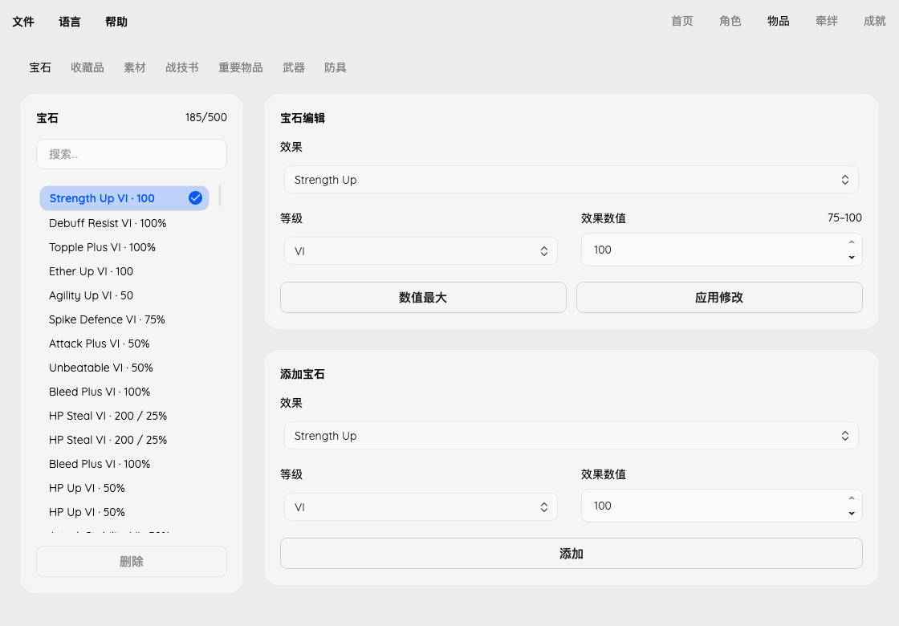

# Gem editing

Items lists owned normal gems, independently of the selected character. Search
matches the effect name, rank and decoded values. The selected gem's effect,
rank and strength are editable; Max Value applies the current effect/rank's
upper strength bound, not rank VI. Add creates a normal gem with linked effect,
rank and strength limits; Delete removes an unfitted gem without shifting indices.
File → Save persists edits.

The interface supports nine languages; game effect names currently use English.
Cylinders are excluded from this panel, and malformed or unknown records remain
read-only. Existing out-of-range values are not clamped on opening or language
switching. A deliberate edit validates the complete request before writing.

## Game-data limits

The extracted [BTL_skilllist table](https://xenoblade.github.io/xb1de/bdat/bdat_common/BTL_skilllist.html)
provides 528 rank definitions for 88 nonzero-attribute effects. `lower_E` through
`upper_S` define ranks I–VI; `percent_E` through `percent_S` define fixed
activation chances. Impurity and unused zero-attribute effects are excluded.
`rvs_type` identifies percentage effects. Strength Up I is 5–10; VI is 75–100.
HP Steal VI restores 150–200 HP with a fixed 25% chance. Chance-only effects,
such as Paralysis, hide the meaningless zero-strength input.

`attach` distinguishes unrestricted, weapon-only and armor-only effects. Changing
a fitted gem checks every inventory item referencing it, including unequipped
items. The effect selector offers compatible effects; existing incompatible
data remains visible without silently repairing it. Remove a gem first to change
it to an effect unsuitable for its current equipment.

These are per-gem definition limits, not combined character stat caps or proof
that a particular effect/rank can be obtained at the current story point.
Future Connected does not automatically upgrade mining ranks or grant gems.

Reproduce the metadata with
`uv run --with beautifulsoup4 python tools/fetch_gem_rules.py` (JSON output).

## Record encoding and write boundaries

Normal gems occupy 500 inventory records of `0x2C` bytes at `0x2C380`.
The game's normal gem initializers in the supplied executable (build ID
`7E1DF8E08D60544BBDCA1E333C153C97`) establish these fields:

| Field | Offset | Encoding |
| --- | --- | --- |
| Fixed global item ID | `+0x04` | 16-bit; zero for crafted gems |
| Rank | `+0x16` | One byte, 1–6 |
| Attribute | `+0x17` | One byte, from `atr_type` |
| Effect ID | `+0x1C` | 16-bit table reference |
| Strength | `+0x1E` | One byte |
| Activation chance | `+0x1F` | One byte |

The initializer at `0xBE1B0`, with stores at `0xBE70C`–`0xBE758`, writes
rank, attribute, effect and the two separate value bytes. The crafted-gem
initializer at `0xC2130` writes a zero global item ID at `0xC259C` and the same
fields at `0xC25AC`–`0xC25F8`. Changing effect or rank therefore clears an unrelated
fixed item ID to the crafted form and updates the attribute. Changing strength
alone preserves the original global item ID. A valid unchanged request is a no-op.

HP Steal VI with strength 200 and chance 25 has packed value `6600`
(`200 | 25 << 8`); Phys Def Down VI at 25% with chance 30% has packed value
`7705`. Neither packed value is a literal strength. GUI labels and CLI output
decode them separately.

Inventory index/type, quantity, acquisition ordering, favorite flags, socket
references and unknown bytes remain unchanged. Editing an equipped gem updates
its existing record; no duplicate is added and no equipment reference is moved.
Built-in gems and cylinders are not editable here.
Creation initializes a new record and advances the acquisition serial counter;
deletion marks an unreferenced record absent. See [inventory validation](inventory.md).

## Verification

Core tests exercise both boundaries and atomic rejection for every definition in
both campaigns, chance-only effects, packed encoding, maximum idempotence,
cylinders, missing and malformed records, unknown campaigns and incompatible
equipment. Real-save tests inspect all supplied saves and edit in-memory copies,
requiring every byte outside the documented fields to remain identical.
GUI tests cover linked ranges, single-gem maximum, invalid drafts, save/selection
and language switching, preservation of unusual existing values, and buffered
lists. CLI tests cover inspection, edits, maxima and rejection without output
changes. Loading edited copies in-game remains a separate verification step.
