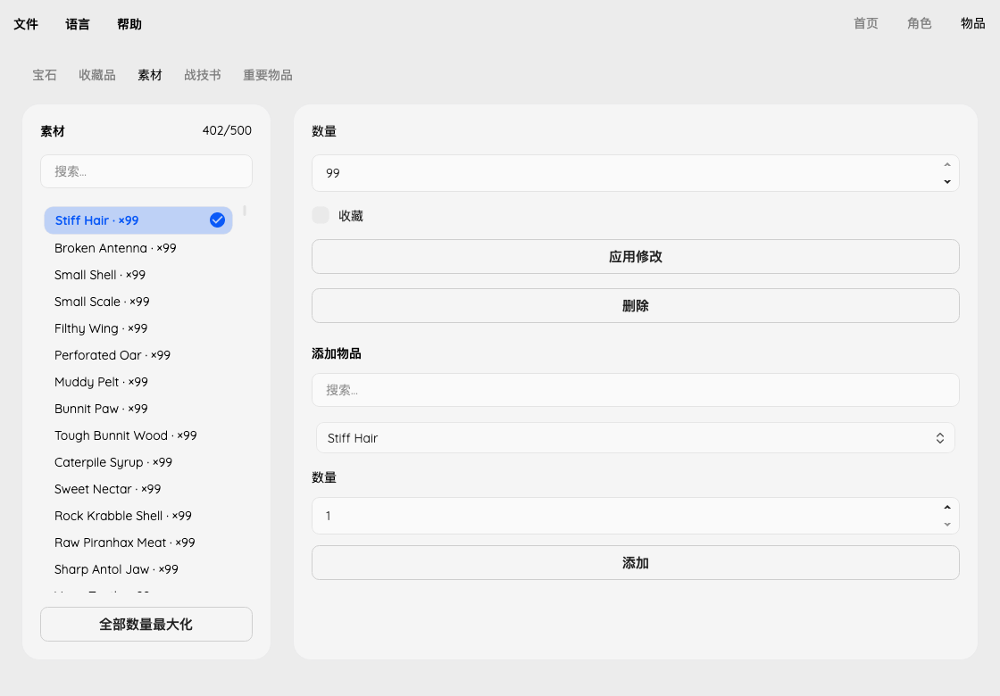

# Inventory editing

Items uses whole-page tabs for Gems, Collectables, Materials, Art Manuals and
Key Items. Ordinary stacks support quantity/favorite editing, creation, deletion
and a category-wide maximum of existing quantities. Adding an existing item
increases its stack rather than creating a duplicate. Key items are view-only
because their quest-state dependencies have not been validated.

The [extracted item list](https://xenoblade.github.io/xb1de/bdat/bdat_common/ITM_itemlist.html)
provides 1,353 named stackable definitions. Empty and numeric-placeholder names
are excluded from creation; existing unknown IDs remain visible and read-only.
Intermediate, Advanced and Master art manuals have distinct IDs and labels.
Metadata is reproducible with
`uv run --with beautifulsoup4 python tools/fetch_inventory_catalog.py` (TSV output).
Catalog membership does not prove obtainability at the current story point.

## Native validation

The supplied executable has build ID `7E1DF8E08D60544BBDCA1E333C153C97`.
The generic item-add function at `0xBF350` clamps stack quantities to 99 at
`0xBF5A8` and stores the resulting 16-bit quantity at `0xBF5B4`.
The allocator at `0x9A480` uses 500 slots per type. At `0x9AB70`–`0x9AB88`
it increments the type's serial counter and writes the new record's serial.
The crafted-gem initializer at `0xC2130` initializes the header and effect fields.

| Bank | Type | Save offset | Record bytes |
| --- | --- | --- | --- |
| Normal gems / cylinders | 3 | `0x2C380` | `0x2C` |
| Collectables | 10 | `0x31970` | `0x14` |
| Materials | 11 | `0x34080` | `0x14` |
| Key items | 12 | `0x36790` | `0x14` |
| Art manuals | 13 | `0x38EA0` | `0x14` |

Each stack record stores index/type at `+0x00/+0x02`, global item ID/type at
`+0x04/+0x06`, quantity at `+0x08`, acquisition serial at `+0x0C`, presence at
`+0x10` and favorite at `+0x11`. Serial counters begin at
`0x46900 + type * 4`. Creation validates the request before clearing a free
record and assigns a serial greater than both the counter and existing records.
Counter overflow, a full bank or duplicate stacks reject creation atomically.
Unknown nonzero presence flags are not treated as free slots.

Deletion changes only the presence flag. Records are not compacted and counters
are not rewound. Gem creation also skips indices referenced by any inventory
weapon or armor, including unequipped and unrecognized equipment. Gem deletion
requires a valid normal gem with no equipment references. Cylinders and built-in
gems are outside these operations.

## Verification

Core tests cover both campaigns, byte boundaries, stack merging, quantity limits,
malformed records, duplicate stacks, serial overflow, stale counters, full banks,
deletion/reuse and dangling gem references. In-memory copies of the eight supplied
saves exercise quantity edits and creation without touching the source files.
GUI tests exercise drafts, invalid tab/save transitions, nine-language switching,
creation/deletion and small-window spacing. CLI tests compare complete expected
files and ensure rejected edits leave existing outputs untouched.
Loading an edited copy in-game remains a separate verification step.
