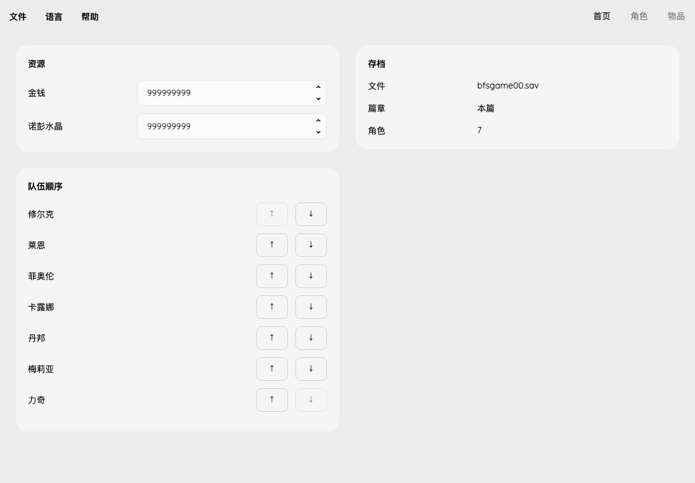

# Party order

Main has a separate Party Order card with up/down controls for each saved member.
The card grows with its contents and uses the page's shared scrolling container.
No extra Apply button is needed: arrows change the in-memory order, and
File → Save writes it with the other edits. Character selection remains attached
to the same character ID after a move.

The [published format reference](https://github.com/hanyu1774/XCDE-Save-File-Editor/blob/master/XCDESave/Party.cs)
describes twelve 16-bit character IDs followed by an 8-bit count. The supplied
saves place this structure at `0x152318`. Reordering changes only the first
`count * 2` bytes. Count, inactive array entries, Ponspector data and character
records are untouched. Character records are indexed by character ID, not by
position in the party array.

Only a permutation of current members is accepted. Known main-story characters
and the four Future Connected characters are supported; story guests and ambiguous
campaigns remain protected. This operation does not recruit a character or remove
story restrictions. It does not edit a separate battle-formation or recruitment flag.

Tests cover both campaigns, invalid permutations, no-op/restoration behavior,
unrelated byte preservation, all supplied real saves, GUI move boundaries and CLI
atomic rejection. In-game loading remains a separate verification step.
