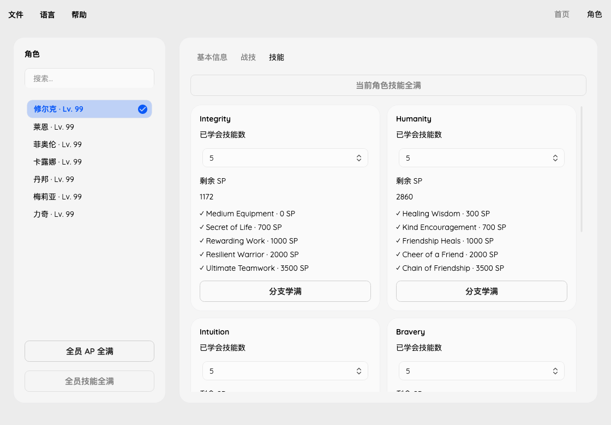

# Skill tree validation

Characters → Skills displays all five branches as cards. The learned count and
remaining SP are separate save fields. Choosing a count resets remaining SP;
maximum operations write five learned skills and zero remaining SP. Tree-learning operations never
select a different active tree, change skill links or grant hidden-tree task
unlocks. Party-wide maximum applies to joined characters, not search results.

The first branch contains an innate zero-cost skill, so its count accepts 1–5.
Other branches accept 0–5. Remaining SP must be below the next skill's cost and
cannot be edited on a completed branch. Existing higher SP is retained on load
and unrelated edits. Invalid drafts prevent saving instead of being silently
clamped. Future Connected does not have skill trees; its records are read-only.

## Catalog and native checks

The catalog contains 200 nodes in 40 branches, covering character IDs 1–8. Both
Fiora forms have separate node blocks and share the same hidden-branch flags.

- [BTL_PSVskill](https://xenoblade.github.io/xb1de/bdat/bdat_common/BTL_PSVskill.html): node names and `point_PP` learning costs.
- [BTL_PSVlink](https://xenoblade.github.io/xb1de/bdat/bdat_common/BTL_PSVlink.html): hidden-branch flag indices.
- [MNU_personally_name_ms](https://xenoblade.github.io/xb1de/bdat/bdat_common_ms/MNU_personally_name_ms.html): branch names.

Local executable checks use build ID `7E1DF8E08D60544BBDCA1E333C153C97`:

- `0x845DC–0x84600` reads `point_PP` and multiplies by 100. `point_SP` is a separate skill-link coin cost and is not used as the learning threshold.
- `0x8519C–0x852CC` consumes SP, advances the learned count and stores the remainder.
- Character record offsets `+0x7C` and `+0x90` store five unsigned 32-bit SP values and learned counts respectively.
- `0x85570` and `0xB26A0–0xB26E4` read hidden flag `f` through packed bit `0x2CDD + f`, based at save offset `0x50`.
- The skill initializer at `0x83D70` handles IDs 1–8; Future Connected bypasses tree setup.

Synthetic tests cover all eight owners, native flag mapping, cost boundaries,
rejected edits, locked branches, bulk operations and byte isolation. Local real
saves are tested on in-memory copies only. GUI and CLI checks cover the same
operations. These checks do not substitute for loading an edited copy in-game.

## Skill links

Characters → Skill Links displays one card per available source character, with
five direct slot selectors. Choices include only learned skills with matching
shapes, no duplicate assignment from that source, and an affordable coin cost.
Selecting None clears one link. Affinity Coins are a reusable budget; assignments
do not spend coins or add SP. Already overspent links retain the native budget
floor, so a replacement cannot increase their total beyond the existing cost.
Unknown assignments are inspectable and explicitly removable, never normalized
on opening. Locked slots and unavailable source rows remain unchanged.

The extra catalog columns come from `BTL_PSVskill.shape` and `point_SP`.
[MNU_PSset](https://xenoblade.github.io/xb1de/bdat/bdat_menu_psv/MNU_PSset.html)
contains 64 recipient/source rows, with five shapes per row. The row ID is
`8 * (recipient - 1) + source`. Numeric shapes are 1 Circle, 2 Square, 3 Hexagon,
4 Octagram/star and 5 Diamond. Self rows are zero; no configured slot uses Diamond.
Generate the catalogs with `tools/fetch_skill_definitions.py` and
`tools/fetch_skill_link_shapes.py`, using BeautifulSoup.

Verified native paths in the same executable build:

- `0x7179C–0x717AC` registers `MNU_PSset` as table `0x86`; `0x84124–0x843D8`
  selects the recipient/source rows and loads their shapes.
- `0x84548–0x8463C` loads the global node ID, its shape and coin cost.
- `0xA6F94–0xA6F98` writes the runtime skill object through `0x85D20` to saved
  character `+0x78`. This copies eight u32 unlock indices to `+0xA4..C3` and
  forty u8 skill IDs to `+0xC4..EB`. Each source has five IDs, including the
  self-row. The loader `0x85EB0–0x85F94` reverses this layout.
- `0x85770` tests highest unlocked index against the zero-based slot index;
  stored zero enables the first slot, while four enables all five.
  `0x857A0` raises this value monotonically. `0xBC240` derives indices 0–4 from
  affinity thresholds 0, 1,000, 2,000, 3,000 and 4,000; lowering affinity does
  not relock previously unlocked slots. Link editing does not change affinity.
- `0x855B0` gates source availability with saved story u16 at `0xDF0`:
  IDs 1/2 always, 3 at 11–41, 5 from 69, 4 from 100, 7 from 128, 6 from 137,
  and 8 from 273. Saved byte `0x5EB` bit `0x10` overrides the list to IDs 1–8
  except 3. The editor additionally requires the source to be joined.
- `0x18B690` checks learned skills, replacement coin budget, shape, slot unlock
  and duplicates before assignment. `0x18B8E0–0x18B908` uses
  `max(owned coins, current linked cost) - current linked cost + replaced cost`.
  `0x85860` writes only a shape-matching runtime record; `0x858C0` clears it.
- Fiora's IDs 3/8 share affinity, but retain separate saved rows. Neither form
  can link from the other. Inactive early-Fiora rows are preserved rather than
  remapped into later-Fiora rows.

Tests cover all available recipient/source shapes, one-byte writes, replacement,
removal, duplicates, unlearned/hidden skills, insufficient coins, story thresholds,
unknown IDs, campaign/version protection, GUI saving and all nine UI languages.
All four supplied main-story saves contain 210 populated links matching the
decoded shapes and sources; reassignment/removal is checked on in-memory copies.
Actual loading of a newly edited link still requires in-game verification.
